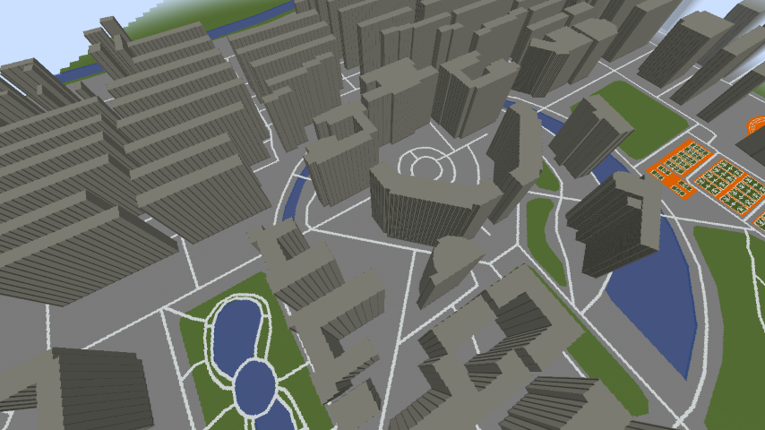
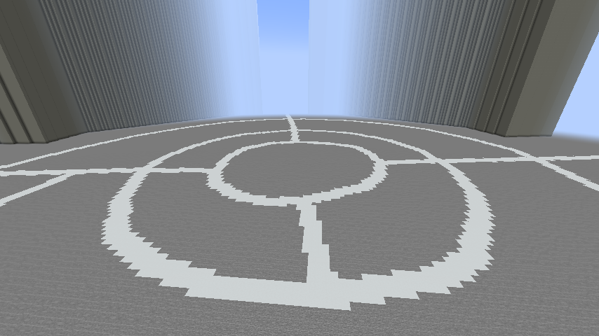
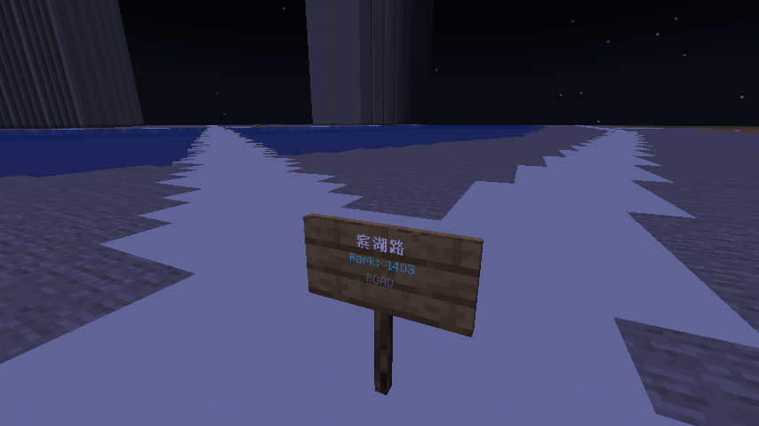
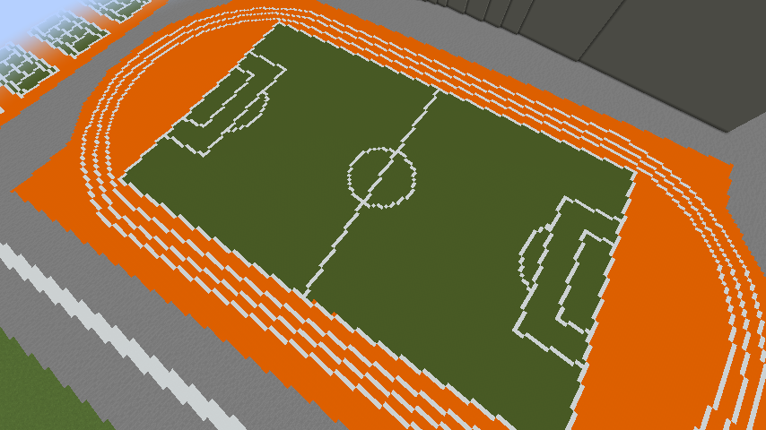

# CraftAMap

本工具可以将高德地图的数据导入到 Minecraft 中。

- 支持导出`区域`、`三维建筑`、`道路`、`地表`、`路标`
- 支持自定义导出的方块类型
- 支持修改导出缩放比例

## 效果展示

| 建筑                        | 道路                    | 地标                   | 操场                  |
|---------------------------|-----------------------|----------------------|---------------------|
|  |  |  |  |

## 使用说明

### 快速开始
1. 下载 [地图数据导出工具](https://github.com/hyunel/CraftAMap-Exporter/releases) 选取需要导出的区域，并导出地图数据。
2. 启动一个 `1.19+` 版本 [Paper](https://papermc.io/downloads) 服务器，并在 `plugins` 文件夹中放入[本插件](https://github.com/hyunel/CraftAMap/releases) 与 [FastAsyncWorldEdit](https://www.spigotmc.org/resources/fastasyncworldedit.13932/)
3. 待启动完毕后，将地图数据放入 `plugins\CraftAMap\mapdata` 文件夹中。
4. 给自己 OP 或 `craftamap.admin` 权限。
5. 站到一个合适的位置作为基准点，面朝一个合适的方向（推荐在一个平坦世界）。
6. 输入 `/amap <地图数据文件名>` 命令，即可生成地图（应当在了你面朝方向的右前方）。

### 指令

> 插件用法很简单，只有一个命令：  
`/amap <map> [-s <scale>] [-b <fill|shell>] [-l <layer>]`

**参数说明如下：**

| 参数                | 说明                                                     | 必选                            | 默认值                                 |
|-------------------|--------------------------------------------------------|-------------------------------|-------------------------------------|
| `<map>`           | `mapdata` 文件夹内的地图数据文件名                                 | :white_check_mark:            |                                     |
| `-s <scale>`      | 缩放比例                                                   | :negative_squared_cross_mark: | `1`                                 |
| `-b <fill,shell>` | 填充方式，`shell` 只建造外壳，`fill` 填充整栋建筑                       | :negative_squared_cross_mark: | `shell`                             |
| `-l <layer>`      | 导出的图层，可选 `area`、`building`、`road`、`surface`、`landmark` | :negative_squared_cross_mark: | `region,road,building,poi,roadName` |
